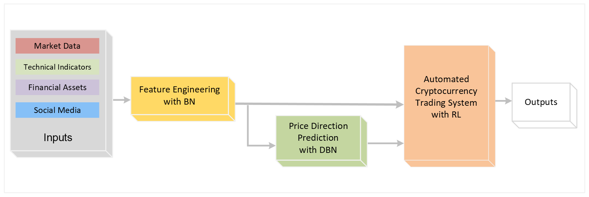

# CausalReinforcementNet (CRN)

**Adaptive RL Framework for Cryptocurrency Trading with Causal Feature Engineering and Regime Awareness**

---

### Overview

CausalReinforcementNet (CRN) is a flexible, modular reinforcement learning framework tailored for cryptocurrency trading. It combines causal feature engineering, regime-aware Bayesian inference, and user-defined risk constraints to generate intelligent, interpretable, and adaptive trading strategies. The framework integrates reinforcement learning agents with Dynamic Bayesian Networks (DBNs) to adjust position sizing and actions based on latent market conditions.  



---

### Key Features

- **Causal Feature Engineering**  
  Integrates domain knowledge into feature construction to improve robustness and interpretability.

- **Regime-Aware Trading Logic**  
  Leverages Dynamic Bayesian Networks to detect market regimes and adjust trading behavior accordingly.

- **Position Sizing Rules**  
  Applies rule-based logic to adapt trade size based on confidence levels and user-defined thresholds.

- **Modular Reinforcement Learning**  
  Supports multiple RL algorithms including PPO and DDPG, enabling ablation and benchmarking.

- **Backtest-Ready**  
  Includes comprehensive evaluation metrics such as ROI, Sharpe Ratio, drawdown, and reward component analysis.

---

### Input Feature Groups

The CRN framework uses the following input features:

- **Market Data (OHLCV)**  
  - `Open`, `High`, `Low`, `Close`, `Volume`

- **Technical Indicators**  
  - `EMA` (Exponential Moving Average)  
  - `MACD` (Moving Average Convergence/Divergence)  
  - `RSI` (Relative Strength Index)  
  - `OBV` (On-Balance Volume)  
  - `AD` (Accumulation/Distribution)  
  - `BBands` (Bollinger Bands)  
  - `SMA` (Simple Moving Average)  
  - `Stoch` (Stochastic Oscillator)  
  - `AROON`  
  - `CCI` (Commodity Channel Index)

- **Macro-Financial Assets**  
  - `Gold`  
  - `S&P500`  
  - `MSCI`  
  - `USDX` (U.S. Dollar Index)  
  - `WTI` (Crude Oil Price)

- **Social Media**  
  - `Daily Tweet Count` (Bitcoin-related tweets)

> Feature selection is performed using **Bayesian Networks (BNs)**.

---

###  Requirements

To run and evaluate CRN agents, the following packages are required:

- [Python ≥ 3.6](https://www.python.org/)
- [NumPy](https://numpy.org/) — numerical operations  
- [Pandas](https://pandas.pydata.org/) — data manipulation  
- [Matplotlib](https://matplotlib.org/) — visualizations (optional)  
- [Stable-Baselines3](https://github.com/DLR-RM/stable-baselines3) — RL algorithms (DDPG, PPO)  
- [PyTorch](https://pytorch.org/) — deep learning backend  
- [Gym](https://github.com/openai/gym) — RL environment interface  
- [Gymnasium](https://github.com/Farama-Foundation/Gymnasium) — extended Gym support  
- [pysmile](https://www.bayesfusion.com/docs/smile/) — Bayesian Network inference  
- [NetworkX](https://networkx.org/) — graph operations for BNs  
- [python-dateutil](https://dateutil.readthedocs.io/) — date parsing utilities  
- [SymPy](https://www.sympy.org/en/index.html) — symbolic math  
- [Jinja2](https://palletsprojects.com/p/jinja/) — for templating (if report generation is added)

To install all packages:
```bash
pip install -r requirements.txt

### Supported Cryptocurrencies

The CRN framework has been tested and validated on the following major altcoins:

- Binance Coin (BNB)
- Ethereum (ETH)
- Litecoin (LTC)
- Ripple (XRP)
- Tether (USDT)

### Important Disclaimer

This framework is developed solely for academic and research purposes. It is not intended for commercial use or real-world financial trading.

